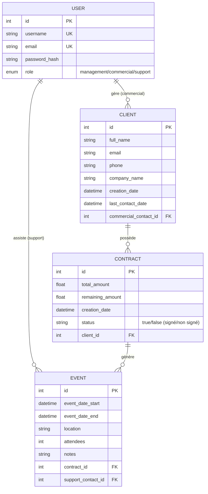

# Schéma de la Base de Données Epic Events

Ce document présente le schéma de la base de données PostgreSQL utilisée par l'application Epic Events CRM.

## Diagramme Mermaid

## Description des Tables

### Table: `users`
Stocke les informations des collaborateurs d'Epic Events.

- **id** (PK): Identifiant unique
- **username** (UNIQUE): Nom d'utilisateur unique
- **email** (UNIQUE): Email unique
- **password_hash**: Mot de passe hashé avec Argon2 (jamais stocké en clair)
- **role** (ENUM): Rôle du collaborateur
  - `management`: Équipe de gestion
  - `commercial`: Équipe commerciale
  - `support`: Équipe de support

### Table: `clients`
Stocke les informations des clients.

- **id** (PK): Identifiant unique
- **full_name**: Nom complet du client
- **email**: Email du client
- **phone**: Numéro de téléphone (optionnel)
- **company_name**: Nom de l'entreprise (optionnel)
- **creation_date**: Date de création du client (auto)
- **last_contact_date**: Date du dernier contact (mise à jour automatique)
- **commercial_contact_id** (FK): Référence vers le commercial responsable

### Table: `contracts`
Stocke les contrats associés aux clients.

- **id** (PK): Identifiant unique
- **total_amount**: Montant total du contrat
- **remaining_amount**: Montant restant à payer
- **creation_date**: Date de création (auto)
- **status**: État de signature ("true" = signé, "false" = non signé)
- **client_id** (FK): Référence vers le client

### Table: `events`
Stocke les événements associés aux contrats.

- **id** (PK): Identifiant unique
- **event_date_start**: Date et heure de début
- **event_date_end**: Date et heure de fin
- **location**: Lieu de l'événement
- **attendees**: Nombre de participants
- **notes**: Notes complémentaires
- **contract_id** (FK): Référence vers le contrat
- **support_contact_id** (FK): Référence vers le membre du support assigné

## Relations

1. **USER → CLIENT** (1:N)
   - Un commercial gère plusieurs clients
   - Un client est associé à un seul commercial

2. **USER → EVENT** (1:N)
   - Un membre du support peut être assigné à plusieurs événements
   - Un événement est assigné à un seul membre du support

3. **CLIENT → CONTRACT** (1:N)
   - Un client peut avoir plusieurs contrats
   - Un contrat appartient à un seul client

4. **CONTRACT → EVENT** (1:N)
   - Un contrat peut générer plusieurs événements
   - Un événement est lié à un seul contrat

## Règles de Gestion

- Un contrat doit être **signé** (status="true") avant de pouvoir créer un événement
- Seul le **commercial responsable** peut modifier ses clients
- Seule l'**équipe de gestion** peut créer des contrats et assigner des événements au support
- Seul le **support assigné** peut modifier ses événements
- Les mots de passe sont **hashés avec Argon2** et jamais stockés en clair
- Les tokens JWT sont utilisés pour l'authentification avec une durée de validité de 24h
